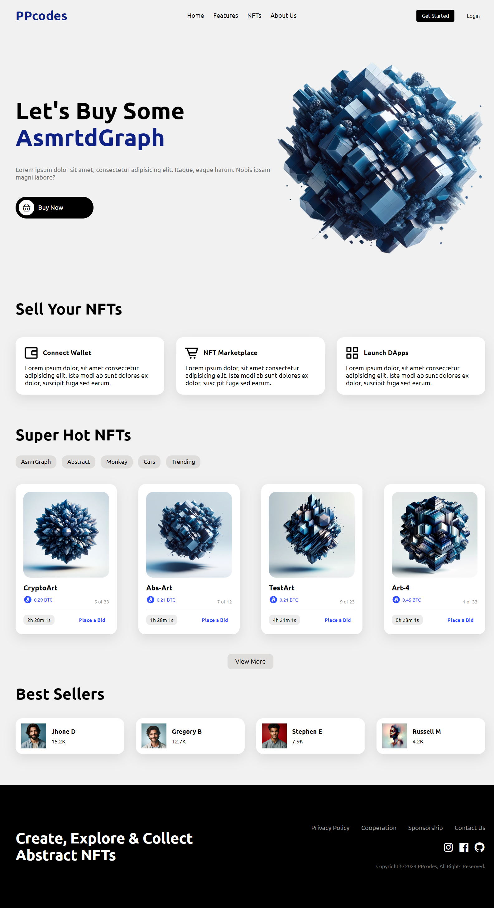

# Responsive NFT Website

I've used modern HTML and CSS to create a completely responsive NFT Website with awesome color theme. We'll be using CSS Flexbox, Media queries for our responsive design and CSS  transition for some cool animation effects. This project contains NFT Marketplace, Best Sellers, Guarantee, Footer, Navbar and a Header section😉

If you like this, then feel free to give it a star.⭐

# Screenshot
Here we have project screenshot :

